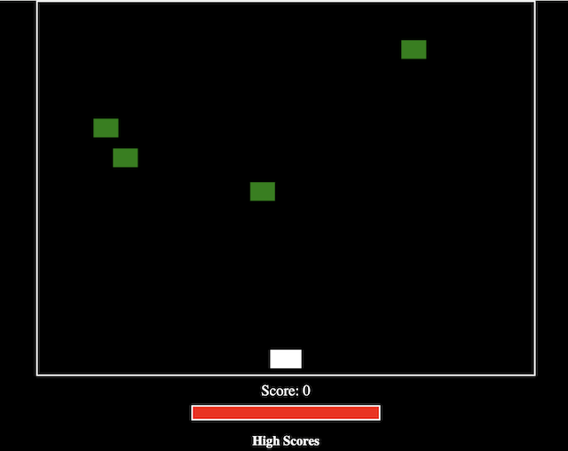
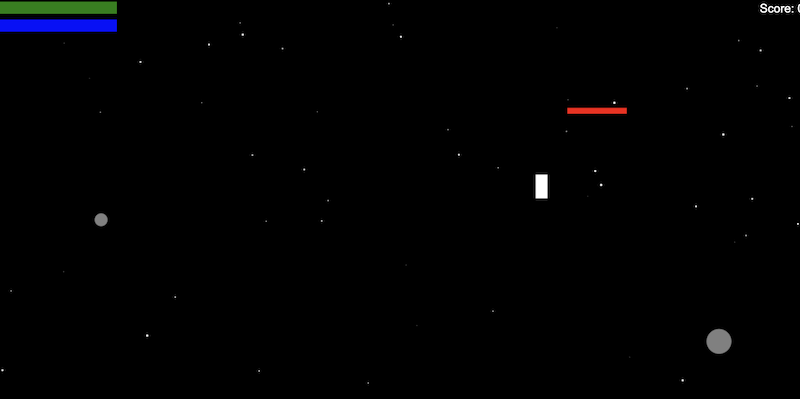
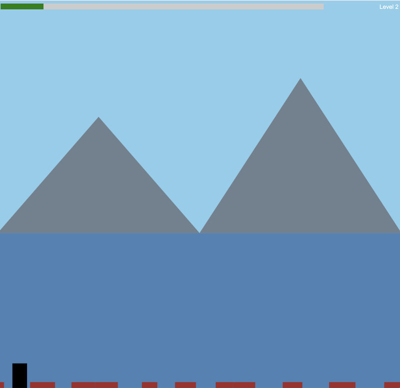

Little CSS/JS games developed by Jon and Alex with ChatGPT.

## [Space Shooter](space_shooter/space_shooter6.html)

The Space Shooter game is an engaging 2D browser-based arcade game where players control a spaceship to defend against waves of incoming aliens. Players can move the spaceship left and right, firing multiple missiles that increase in number as their score climbs. Each time an alien bypasses the player, health decreases, indicated by both a status bar reduction and a brief screen flash. The game keeps track of the top five high scores, which are stored persistently in the browser's local storage along with timestamps, adding a competitive edge. The game ends when the player's health is fully depleted, challenging players to achieve higher scores with each playthrough.

* [Click to play now](space_shooter/space_shooter6.html)

(see old versions: [v1](space_shooter/space_shooter1.html), [v2](space_shooter/space_shooter2.html), [v3](space_shooter/space_shooter3.html), [v4](space_shooter/space_shooter4.html), [v5](space_shooter/space_shooter5.html))

### Game Controls:
* Use the Left Arrow key to move the spaceship left.
* Use the Right Arrow key to move the spaceship right.
* Press the Spacebar to fire missiles at the aliens.

### Game Mechanics:
* The goal is to shoot down the aliens to gain points.
* You start with fully health. Each time an alien reaches the bottom of the screen, you lose health.
* The game ends when you run out of health, and your final score is displayed.

Developed August 25 2024 with ChatGPT4o.

## [Rocket Ship](rocket_ship/rocket_ship5.html)

In this thrilling 2D browser-based game, you pilot a tiny rocket ship navigating through the vastness of space, aiming to reach a designated red platform while avoiding perilous meteors. With limited thrust power, which regenerates over time, you must carefully control your rocket's movement using precise bursts of thrust to avoid getting stuck in the gravity well or colliding with obstacles. To aid your journey, green health meteors occasionally appear, providing a much-needed boost to your health when collected. The challenge escalates with each level as you race against time, making quick decisions to dodge hazards and reach your goal while preserving your rocket’s integrity.

* [Click to play now](rocket_ship/rocket_ship5.html)

(see old versions: [v1](rocket_ship/rocket_ship1.html), [v2](rocket_ship/rocket_ship2.html), [v3](rocket_ship/rocket_ship3.html), [v4](rocket_ship/rocket_ship4.html))

### Game Controls:
* Arrow Left/Right: Move the rocket left or right.
* Space Bar: Fire the rocket's jets to move upwards. The fire animation will appear, and the thrust bar will decrease. The thrust bar now regenerates faster.

### Game Mechanics:
* Objective: Reach the red platform to complete the level. Avoid grey meteors, and try to collect green health meteors to restore health.

Developed August 26 2024 with ChatGPT4o.

## [Stickman](stickman/stickman11.html)

In this exciting side-scrolling platformer, players take on the role of a determined runner navigating through a series of increasingly challenging levels filled with treacherous pits and obstacles. As the game progresses, the world moves faster, testing the player's reflexes and precision jumping skills. A dynamic progress bar at the top of the screen tracks the player's journey toward the level's end, while a level indicator keeps them informed of their advancement. Each level culminates in a congratulatory message and a prompt to continue to the next, where the difficulty ramps up. With intuitive controls and escalating challenges, this game offers an engaging and rewarding experience for players seeking a thrilling platformer adventure.

* [Click to play now](stickman/stickman11.html)

### Game Controls:

- **Right Arrow Key (`→`)**: Move the player to the right.
- **Left Arrow Key (`←`)**: Move the player to the left.
- **Up Arrow Key (`↑`)**: Make the player jump.
- **Any Key**: Restart the game after "Game Over" or advance to the next level after completing a level.

Developed August 27 2024 with ChatGPT4o.

